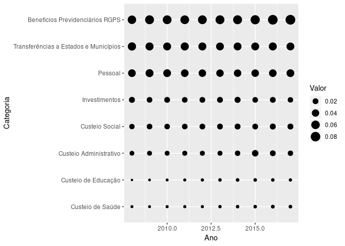

R Notebook
================

This is an [R Markdown](http://rmarkdown.rstudio.com) Notebook. When you execute code within the notebook, the results appear beneath the code.

Try executing this chunk by clicking the *Run* button within the chunk or by placing your cursor inside it and pressing *Ctrl+Shift+Enter*.

``` r
library(tidyverse)
```

    ## ── Attaching packages ─────────────────────────────────────────────────────── tidyverse 1.2.1 ──

    ## ✔ ggplot2 3.0.0     ✔ purrr   0.2.5
    ## ✔ tibble  1.4.2     ✔ dplyr   0.7.6
    ## ✔ tidyr   0.8.1     ✔ stringr 1.3.1
    ## ✔ readr   1.1.1     ✔ forcats 0.3.0

    ## ── Conflicts ────────────────────────────────────────────────────────── tidyverse_conflicts() ──
    ## ✖ dplyr::filter() masks stats::filter()
    ## ✖ dplyr::lag()    masks stats::lag()

``` r
library(readxl)
library(ipeaData)

dados_brutos <- read_xlsx('./despesasBrasil2008a2017.xlsx', skip = 9)
pibs <- ipeadata("BM12_PIBAC12")
```

    ## [1] "NA. 01/1990 a 09/2018. Acesso em: 12/11/2018"

``` r
dados_brutos
```

    ## # A tibble: 10 x 11
    ##    `Sankey - Estru… `DEZ/2008` `DEZ/2009` `DEZ/2010` `DEZ/2011` `DEZ/2012`
    ##    <chr>                 <dbl>      <dbl>      <dbl>      <dbl>      <dbl>
    ##  1 Pessoal             1.42e11    1.66e11    1.83e11    1.97e11    2.04e11
    ##  2 Custeio de Saúde    7.86e 9    8.34e 9    1.08e10    1.26e10    1.42e10
    ##  3 Custeio de Educ…    6.26e 9    7.29e 9    9.52e 9    1.19e10    1.50e10
    ##  4 Custeio Social      4.78e10    5.91e10    6.67e10    7.72e10    9.12e10
    ##  5 Custeio Adminis…    3.34e10    3.95e10    4.53e10    5.44e10    6.06e10
    ##  6 Benefícios Prev…    1.85e11    2.25e11    2.55e11    2.82e11    3.17e11
    ##  7 Investimentos       6.64e10    6.06e10    7.74e10    7.86e10    9.24e10
    ##  8 Transferências …    1.72e11    1.72e11    1.93e11    2.27e11    2.44e11
    ##  9 Juros               1.10e11    1.24e11    1.22e11    1.31e11    1.34e11
    ## 10 Amortização da …    4.49e11    5.18e11    5.13e11    5.77e11    6.19e11
    ## # ... with 5 more variables: `DEZ/2013` <dbl>, `DEZ/2014` <dbl>,
    ## #   `DEZ/2015` <dbl>, `DEZ/2016` <dbl>, `DEZ/2017` <dbl>

``` r
pibs
```

    ##         SERCODIGO                   VALDATA DIA MES  ANO  VALVALOR NIVNOME
    ##   1: BM12_PIBAC12 1990-01-01T00:00:00-02:00   1   1 1990       0.7        
    ##   2: BM12_PIBAC12 1990-02-01T00:00:00-02:00   1   2 1990       1.1        
    ##   3: BM12_PIBAC12 1990-03-01T00:00:00-03:00   1   3 1990       1.8        
    ##   4: BM12_PIBAC12 1990-04-01T00:00:00-03:00   1   4 1990       2.5        
    ##   5: BM12_PIBAC12 1990-05-01T00:00:00-03:00   1   5 1990       3.3        
    ##  ---                                                                      
    ## 341: BM12_PIBAC12 2018-05-01T00:00:00-03:00   1   5 2018 6650670.5        
    ## 342: BM12_PIBAC12 2018-06-01T00:00:00-03:00   1   6 2018 6678340.3        
    ## 343: BM12_PIBAC12 2018-07-01T00:00:00-03:00   1   7 2018 6717321.2        
    ## 344: BM12_PIBAC12 2018-08-01T00:00:00-03:00   1   8 2018 6755577.5        
    ## 345: BM12_PIBAC12 2018-09-01T00:00:00-03:00   1   9 2018 6794956.4        
    ##      TERCODIGO TERNOME
    ##   1:                  
    ##   2:                  
    ##   3:                  
    ##   4:                  
    ##   5:                  
    ##  ---                  
    ## 341:                  
    ## 342:                  
    ## 343:                  
    ## 344:                  
    ## 345:

``` r
# VALOR EM DEZEMBRO DE 2008 a 2017
pibs <- pibs[MES=="12" & ANO %in% (2008:2017)]$VALVALOR

#NOMEANDO COLUNAS DO VETOR COM ANOS RESPECTIVOS - 2008 a 2017
names(pibs) <- as.character(c(2008:2017))
pibs
```

    ##    2008    2009    2010    2011    2012    2013    2014    2015    2016 
    ## 3109803 3333039 3885847 4376382 4814760 5331619 5778953 5995787 6259228 
    ##    2017 
    ## 6559940

``` r
dados_brutos
```

    ## # A tibble: 10 x 11
    ##    `Sankey - Estru… `DEZ/2008` `DEZ/2009` `DEZ/2010` `DEZ/2011` `DEZ/2012`
    ##    <chr>                 <dbl>      <dbl>      <dbl>      <dbl>      <dbl>
    ##  1 Pessoal             1.42e11    1.66e11    1.83e11    1.97e11    2.04e11
    ##  2 Custeio de Saúde    7.86e 9    8.34e 9    1.08e10    1.26e10    1.42e10
    ##  3 Custeio de Educ…    6.26e 9    7.29e 9    9.52e 9    1.19e10    1.50e10
    ##  4 Custeio Social      4.78e10    5.91e10    6.67e10    7.72e10    9.12e10
    ##  5 Custeio Adminis…    3.34e10    3.95e10    4.53e10    5.44e10    6.06e10
    ##  6 Benefícios Prev…    1.85e11    2.25e11    2.55e11    2.82e11    3.17e11
    ##  7 Investimentos       6.64e10    6.06e10    7.74e10    7.86e10    9.24e10
    ##  8 Transferências …    1.72e11    1.72e11    1.93e11    2.27e11    2.44e11
    ##  9 Juros               1.10e11    1.24e11    1.22e11    1.31e11    1.34e11
    ## 10 Amortização da …    4.49e11    5.18e11    5.13e11    5.77e11    6.19e11
    ## # ... with 5 more variables: `DEZ/2013` <dbl>, `DEZ/2014` <dbl>,
    ## #   `DEZ/2015` <dbl>, `DEZ/2016` <dbl>, `DEZ/2017` <dbl>

``` r
# SUBSTITUINDO TITULOS DAS COLUNAS DO DF datos_brutos c/ Categoria - 2008 - 2009 - ... 2017
colnames(dados_brutos)<- c("Categoria", names(pibs))

for (i in 2:length(dados_brutos)) {
  dados_brutos[,i] <- dados_brutos[,i] / (pibs[colnames(dados_brutos[,i])]*1000000)
}

dados_brutos
```

    ## # A tibble: 10 x 11
    ##    Categoria  `2008`  `2009`  `2010`  `2011`  `2012`  `2013`  `2014`
    ##    <chr>       <dbl>   <dbl>   <dbl>   <dbl>   <dbl>   <dbl>   <dbl>
    ##  1 Pessoal   0.0456  0.0499  0.0472  0.0449  0.0424  0.0414  0.0414 
    ##  2 Custeio … 0.00253 0.00250 0.00278 0.00287 0.00296 0.00334 0.00376
    ##  3 Custeio … 0.00201 0.00219 0.00245 0.00273 0.00311 0.00380 0.00424
    ##  4 Custeio … 0.0154  0.0177  0.0172  0.0176  0.0189  0.0198  0.0206 
    ##  5 Custeio … 0.0107  0.0118  0.0117  0.0124  0.0126  0.0123  0.0159 
    ##  6 Benefíci… 0.0594  0.0675  0.0656  0.0645  0.0658  0.0671  0.0682 
    ##  7 Investim… 0.0213  0.0182  0.0199  0.0180  0.0192  0.0206  0.0228 
    ##  8 Transfer… 0.0554  0.0515  0.0496  0.0518  0.0506  0.0480  0.0484 
    ##  9 Juros     0.0354  0.0372  0.0314  0.0299  0.0278  0.0266  0.0295 
    ## 10 Amortiza… 0.144   0.155   0.132   0.132   0.129   0.108   0.140  
    ## # ... with 3 more variables: `2015` <dbl>, `2016` <dbl>, `2017` <dbl>

``` r
dados <- dados_brutos %>%
  gather(key = "Ano", value = "Valor", `2008`:`2017`) %>%
  filter(!(Categoria %in% c("Amortização da Dívida", "Juros"))) %>%
  mutate(Categoria = factor(Categoria),
         Categoria = fct_reorder(Categoria, Valor),
         Ano = as.integer(Ano))

dados_brutos$Categoria
```

    ##  [1] "Pessoal"                              
    ##  [2] "Custeio de Saúde"                     
    ##  [3] "Custeio de Educação"                  
    ##  [4] "Custeio Social"                       
    ##  [5] "Custeio Administrativo"               
    ##  [6] "Benefícios Previdenciários RGPS"      
    ##  [7] "Investimentos"                        
    ##  [8] "Transferências a Estados e Municípios"
    ##  [9] "Juros"                                
    ## [10] "Amortização da Dívida"

``` r
dados
```

    ## # A tibble: 80 x 3
    ##    Categoria                               Ano   Valor
    ##    <fct>                                 <int>   <dbl>
    ##  1 Pessoal                                2008 0.0456 
    ##  2 Custeio de Saúde                       2008 0.00253
    ##  3 Custeio de Educação                    2008 0.00201
    ##  4 Custeio Social                         2008 0.0154 
    ##  5 Custeio Administrativo                 2008 0.0107 
    ##  6 Benefícios Previdenciários RGPS        2008 0.0594 
    ##  7 Investimentos                          2008 0.0213 
    ##  8 Transferências a Estados e Municípios  2008 0.0554 
    ##  9 Pessoal                                2009 0.0499 
    ## 10 Custeio de Saúde                       2009 0.00250
    ## # ... with 70 more rows

``` r
# GRÁFICO ANO x VALOR C/ OBJETOS GEOMETRICOS (PONTOS) NA COR AZUL:
ggplot(dados, aes(x=Ano, y=Valor)) +
  geom_point(color = "blue", shape=1)
```


``` r
# GRÁFICO ANO x CATEGORIA C/ TAMANHO DOS PONTOS DEFINIDO PELO VALOR ASSOCIADO:
ggplot(dados, aes(x = Ano, y = Categoria, size = Valor)) +
  geom_point()
```



``` r
# GRÁFICO ANO x VALOR C/ TAMANHO DOS PONTOS DEFINIDO PELO VALOR ASSOCIADO 
# E CATEGORIAS SEPARADAS POR COR:
ggplot(dados, aes(x = Ano, y = Valor, color = Categoria, size = Valor)) +
  geom_point()
```


